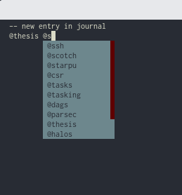

# vim-ycm-jrnl-tags-completer
=============

What is this?
-------------

This is a Vim completer using [YouCompleteMe](https://github.com/Valloric/YouCompleteMe).
It completes tags from [jrnl](http://jrnl.sh/overview.html), so that you may easily
use them back again.



How do I use it?
----------------

 `YCM completers` need to be made available in your `YCM` directory. This completer is
  aimed at completing .txt files that `jrnl` edits. To have it running, you shall put all the python files
  into a new subdirectory `$HOME/.vim/bundle/YouCompleteMe/third_party/ycmd/ycmd/completers/text`.  

  
Troubleshooting:
----------------

It is very likely that your configuration of `YCM` if using the defaults, will not try
to complete files of filetype `text`. Put the additional configuration below to your `.vimrc`
or please refer to [YCM documentation](https://github.com/Valloric/YouCompleteMe#the-gycm_filetype_blacklist-option)
for further explanations.

```
let g:ycm_filetype_blacklist = {}
```

Are there limitations?
----------------------

For now the trigger to completion is hardcoded. If you are not using `@` as your trigger, this will not work for you.
The code is however very straightforward and adapting it for your trigger is a matter of seconds.

